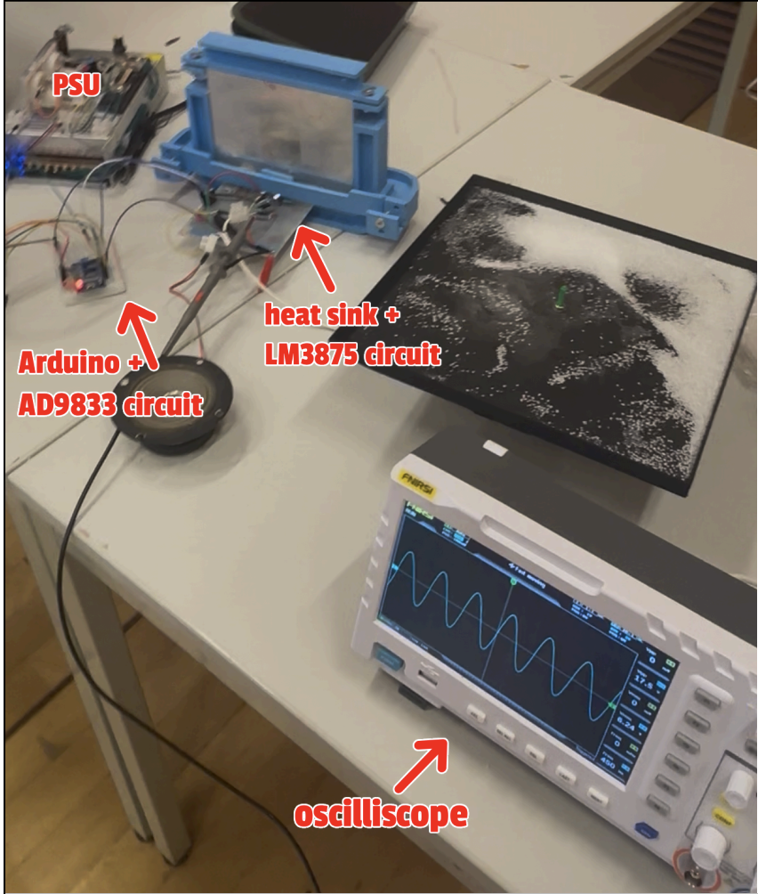
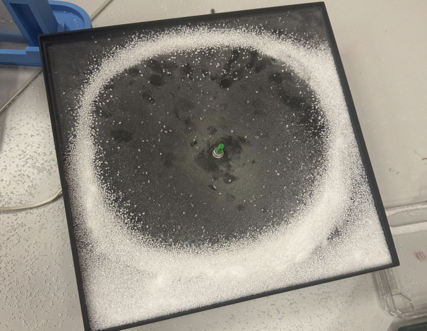
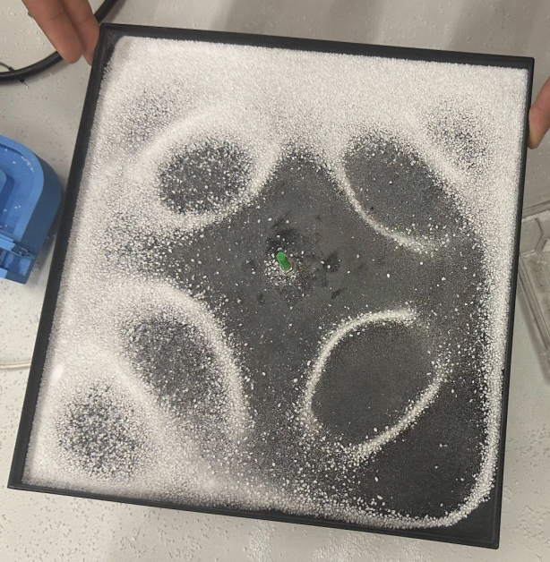
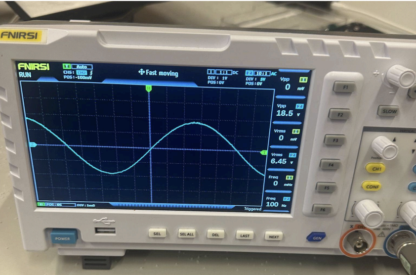
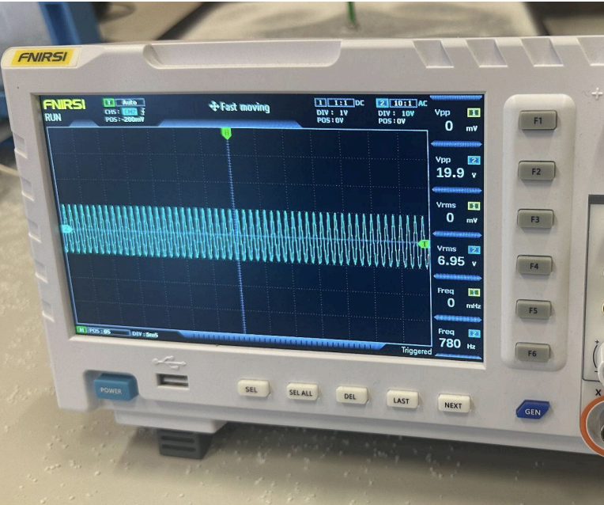
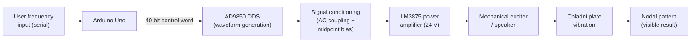
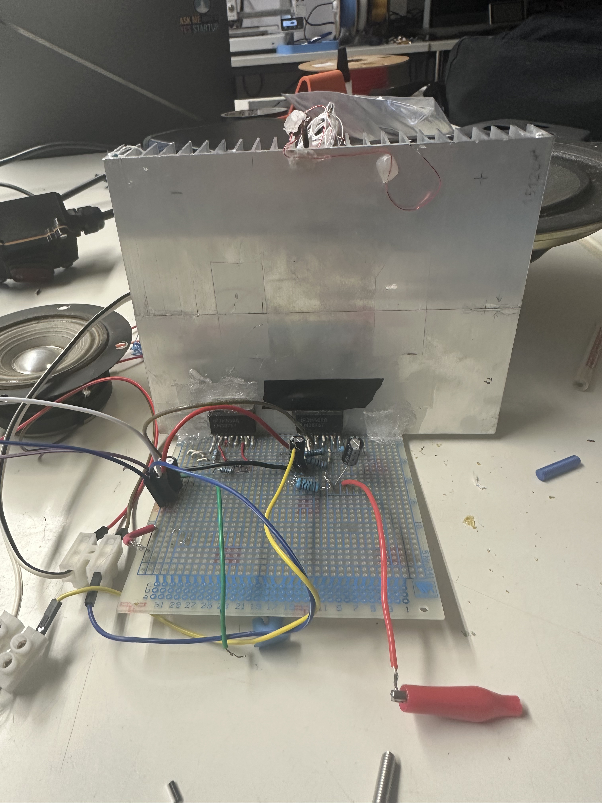

# Chladni Plate Resonance Demonstration System

An Arduino-controlled system that converts a digitally selected excitation frequency into a visible standing-wave pattern on a metal plate, using direct digital synthesis, single-supply signal conditioning, and audio power amplification.


*Full assembled system. Note: the on-image label reads "Arduino + AD9833 circuit" — this is a labeling error from the original annotation. The module used was an AD9850, consistent with the firmware, wiring schematic, and report text/references throughout this project (see [hardware-design.md](docs/hardware-design.md#dds-module-identity--ad9850-not-ad9833)).*

## At a glance

| | |
|---|---|
| **Type** | Undergraduate electronics engineering project (team of 3) |
| **Demonstrated** | Chladni resonance patterns at 100 Hz and 780 Hz, oscilloscope-verified |
| **Core chain** | Arduino Uno → AD9850 DDS → signal conditioning → LM3875 power amplifier → mechanical exciter → plate |
| **Validation method** | Qualitative (oscilloscope waveform checks + visual pattern inspection) — not calibrated modal-analysis instrumentation |
| **Status** | Functional demonstration build, not a finished product |

## Demonstrated result

At 100 Hz the plate settled into a near-circular nodal ring; at 780 Hz it formed a distinct four-lobed pattern. Both are backed by oscilloscope captures showing the actual drive frequency at the time each photo was taken.

| 100 Hz | 780 Hz |
|---|---|
|  |  |
|  |  |

Full write-up of what these images do and don't demonstrate: [experiment-and-results.md](docs/experiment-and-results.md).

## System architecture



Full stage-by-stage breakdown, including which parts of this chain are independently verified vs. described only in the report: [system-architecture.md](docs/system-architecture.md).

## How the system works

The Arduino accepts a frequency typed into the Serial Monitor and loads it into the AD9850 as a 40-bit tuning word, which the AD9850 uses to generate a sine wave at that frequency. That signal is low-power and not correctly referenced for the amplifier, so it passes through a conditioning stage first: a 47 µF capacitor blocks the DC component, and a resistor divider re-centers the waveform on a 12 V midpoint so it stays inside the LM3875's single-supply input range. The LM3875, running from a single 24 V rail, then amplifies the conditioned signal enough to drive a mechanical exciter coupled to the plate. Near one of the plate's natural frequencies, the resulting vibration forms a standing-wave pattern: stationary **nodes** where displacement is minimal, and **antinodes** where motion is greatest. Fine salt on the plate is repeatedly displaced from the antinodes and settles along the nodal lines, making the mode shape visible.

A sine wave — rather than a square wave, which the AD9850 also outputs — was used specifically because it concentrates energy at a single frequency, letting one vibration mode dominate instead of several harmonics exciting the plate at once.

## Team project and my contribution

This was a three-person undergraduate electronics project. **Authors:** Aly Assaf, Alexey Landin, Abdulrahman Ahmed.

The system as a whole — frequency control, DDS waveform generation, signal conditioning, power amplification, and mechanical excitation — was a collaborative team deliverable; no single person built the entire chain alone.

**My (Abdulrahman Ahmed's) contribution:**
- Designed and calculated the AC-coupling and midpoint-bias signal-conditioning network, from scratch.
- Physical circuit assembly and wiring.
- Bench inspection and testing.
- Inspected the retained second LM3875 package and surrounding connections (see [hardware-design.md](docs/hardware-design.md#why-two-lm3875-packages-appear-in-photos)), confirming that it did not introduce unintended shorts or interfere with the active amplifier circuit.
- Primary author of the written technical report.

The Arduino/AD9850 control firmware was implemented by a teammate. I did not author the firmware used during the original demonstration, though I'm comfortable reading, explaining, and extending Arduino/C++ code of this kind — see [firmware.md](docs/firmware.md) for the full protocol write-up.

## Engineering decisions

Adapting the LM3875's split-supply reference design for a single 24 V rail was the project's central engineering problem, solved with AC coupling plus a midpoint-bias network. Why a DDS instead of an analog oscillator, why sine instead of square, and a set of retrospective trade-offs (PCB vs. perfboard, manual vs. automated sweep, visual vs. sensor-based validation) are covered in [engineering-decisions.md](docs/engineering-decisions.md).

## Hardware implementation

Component values (47 µF input coupling capacitor, 2× 2 kΩ bias resistors, ~1000 µF output coupling, single 24 V rail), the LM3875 datasheet reference circuit vs. the as-built single-supply circuit, and wiring photos: [hardware-design.md](docs/hardware-design.md).



## Firmware implementation

Serial workflow, AD9850 pin assignments, the 40-bit control word and frequency tuning-word equation, and known limitations of the code in this repository (which is a **documentation reconstruction**, not the original experimental firmware): [firmware.md](docs/firmware.md).

## Experimental procedure

Plate preparation, frequency selection, and how resonance was located visually rather than with instrumentation: [experiment-and-results.md](docs/experiment-and-results.md).

## Results and evidence

Oscilloscope readings, pattern photos, and an explicit breakdown of what was validated vs. what remains qualitative-only: [experiment-and-results.md](docs/experiment-and-results.md).

## Skills demonstrated

- **Analog signal conditioning** — designing and calculating an AC-coupling/midpoint-bias network to interface a digital waveform source with a single-supply amplifier (report §6, [hardware-design.md](docs/hardware-design.md)).
- **Power amplification integration** — adapting a split-supply datasheet reference design (LM3875) to a single-rail system.
- **Electromechanical system integration** — connecting an amplifier output to a mechanical exciter and reasoning about the full electrical-to-mechanical energy path ([system-architecture.md](docs/system-architecture.md)).
- **Circuit inspection and debugging** — checking the retained LM3875 package and surrounding perfboard connections for unintended shorts or interference before system operation ([hardware-design.md](docs/hardware-design.md#why-two-lm3875-packages-appear-in-photos)).
- **Oscilloscope-based verification** — confirming frequency and amplitude at each demonstrated operating point ([experiment-and-results.md](docs/experiment-and-results.md)).
- **Technical documentation** — authoring the written project report, with calculations and cited references.
- **Collaborative engineering** — integrating individually-built subsystems (firmware, circuit, mechanical assembly) into one working system with teammates.

## Project scope

Built and evaluated as a functional demonstration, not a calibrated measurement instrument — no automated sweep logging, quantified vibration amplitude, or modal-simulation comparison exists for this build. Full scope and current limitations: [project-scope-and-next-steps.md](docs/project-scope-and-next-steps.md).

## Next engineering iteration

Planned/possible follow-on work — automated sweep mode, sensor-based amplitude measurement, PCB revision, frequency display — is listed in [project-scope-and-next-steps.md](docs/project-scope-and-next-steps.md).

## Repository structure

```
.
├── README.md
├── LICENSE                  # see License status below — not a single uniform license
├── docs/
│   ├── system-architecture.md
│   ├── hardware-design.md
│   ├── firmware.md
│   ├── experiment-and-results.md
│   ├── engineering-decisions.md
│   ├── project-scope-and-next-steps.md
│   └── design_notes.md      # original project design notes
├── code/
│   └── arduino_frequency_controller.ino
├── images/
│   ├── final_setup.png
│   ├── pattern_100hz.png
│   ├── pattern_780hz.png
│   ├── oscilloscope_100hz.png
│   ├── oscilloscope_780hz.png
│   ├── Arduino_and_AD9850_connections.jpg
│   ├── Heatsink_and_LM3875_circuit.jpg
│   └── output_coupling_capacitors.jpg
├── schematics/
│   ├── arduino_ad9850_wiring.jpeg
│   └── lm3875_typical_application.png   # LM3875 datasheet reference circuit, not the as-built circuit
└── report/
    └── Chladni Plate Report.pdf
```

## Documentation links

- [System Architecture](docs/system-architecture.md)
- [Hardware Design](docs/hardware-design.md)
- [Firmware](docs/firmware.md)
- [Experiment and Results](docs/experiment-and-results.md)
- [Engineering Decisions](docs/engineering-decisions.md)
- [Project Scope and Next Steps](docs/project-scope-and-next-steps.md)
- [Design Notes](docs/design_notes.md) — original narrative design reasoning
- [Full Technical Report (PDF)](report/Chladni%20Plate%20Report.pdf)

## Authors and attribution

**Project team:** Aly Assaf, Alexey Landin, Abdulrahman Ahmed — Electronics Engineering Project, 2026.

- `schematics/lm3875_typical_application.png` is reproduced from the LM3875 Overture Audio Power Amplifier datasheet (National Semiconductor / Texas Instruments, Rev. E, 2013) for reference — see [LICENSE](LICENSE) for how this is excluded from the repository's license.
- Full reference list, including the AD9850 datasheet (Analog Devices, Rev. E, 2012) and academic sources on Chladni figures, is in the [project report](report/Chladni%20Plate%20Report.pdf)'s References section.

## License status

- **Firmware** (`code/`): no explicit license currently granted. This file is a documentation reconstruction (see [firmware.md](docs/firmware.md)), and authorship/ownership of the reconstruction itself hasn't been settled, so it remains under default copyright for now — see [LICENSE](LICENSE).
- **Documentation, report, and original photos** (`docs/`, `report/`, `images/`, README): [CC BY 4.0](https://creativecommons.org/licenses/by/4.0/) — the project team has confirmed all members are willing to license this material openly. Attribute the project team (Aly Assaf, Alexey Landin, Abdulrahman Ahmed) when reusing.
- **`schematics/lm3875_typical_application.png`** is a manufacturer datasheet figure, reproduced for reference only, and is **not** covered by the above license — see [LICENSE](LICENSE) for the full carve-out.
