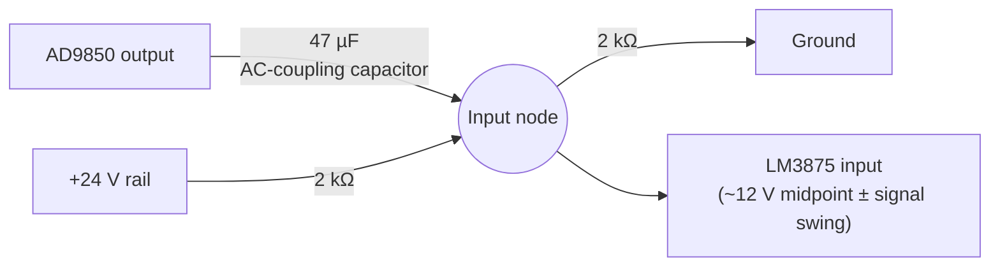

# Hardware Design

This document covers the physical build: the modules used, the signal-conditioning and amplifier component values, and how they were interconnected. Component values are taken directly from the [project report](../report/Chladni%20Plate%20Report.pdf) (Section 6) unless noted otherwise. Nothing below is a value inferred from a photograph — where a value isn't documented in the report, that is stated explicitly.

## Bill of materials (as documented)

| Component | Role | Notes |
|---|---|---|
| Arduino Uno | Frequency control / DDS interface | See [firmware.md](firmware.md) for pin assignments. |
| AD9850 DDS module | Sinusoidal waveform generation | See "DDS module identity" below. |
| LM3875 audio power amplifier (×2, mounted on shared heatsink) | Power amplification | See "Why two LM3875 packages appear in photos" below — only one was in the active signal path. |
| Heatsink | Thermal management for the LM3875 | Visible in [`images/Heatsink_and_LM3875_circuit.jpg`](../images/Heatsink_and_LM3875_circuit.jpg). |
| Input AC-coupling capacitor, 47 µF | Blocks DC from the DDS output before the amplifier input | Report §6.1. |
| Bias resistors, 2× 2 kΩ | Form the single-supply midpoint reference | Report §6.2. |
| Output coupling capacitance, ~1000 µF | Blocks residual DC from reaching the transducer | Report §6.3; implemented in the physical build as two electrolytic capacitors wired in parallel (visible in [`images/output_coupling_capacitors.jpg`](../images/output_coupling_capacitors.jpg)) — the individual capacitor values are not stated in the available documentation. |
| Perfboard | Prototype assembly for the conditioning and amplifier circuit | — |
| Breadboard | Prototype assembly for the Arduino/DDS control circuit | — |
| Bench DC power supply | Powers the amplifier at a single 24 V rail | — |
| Oscilloscope (FNIRSI model) | Waveform verification during setup | Visible in `images/final_setup.png`. |
| Mechanical exciter / speaker | Converts amplified signal into plate vibration | — |
| Metal Chladni plate | Vibration surface | Dimensions/material not documented. |
| Fine salt / sand | Visualization medium | — |

## DDS module identity — AD9850, not AD9833

The report text, the firmware, the wiring schematic, and the references section all consistently identify the DDS module as an **AD9850**. One photo in this repository, `images/final_setup.png` (also used as Figure 3 in the report itself), has a red on-image annotation that reads "AD9833 circuit" — this label is an error made when the photo was originally annotated, not a hardware identity used anywhere else in the project's documentation. It has been left uncorrected in the photo itself (to avoid destructively editing original evidence) but should be read as AD9850, consistent with the rest of the build.

## Why two LM3875 packages appear in photos

Two LM3875 packages are visible on the shared heatsink in [`images/Heatsink_and_LM3875_circuit.jpg`](../images/Heatsink_and_LM3875_circuit.jpg). Only one was used in the project's documented active amplification path. The second package remained physically mounted from an earlier assembly step because removing it would have required extensive desoldering and risked damaging the perfboard or nearby connections. Before the system was operated, the board and surrounding connections were inspected to confirm that the retained package did not introduce unintended short circuits or interfere with the active amplifier circuit.

## Signal conditioning — biasing network

The report describes, but does not draw, the actual single-supply biasing network used in the build (the schematic image included in this repository, `schematics/lm3875_typical_application.png`, is the LM3875 datasheet's generic *split-supply* reference circuit — see below). The diagram here is a redrawn illustration of the circuit **described in report §6.1–6.2**, for clarity — it is not a scan or reconstruction of an original design file.

With the two 2 kΩ resistors in parallel from the amplifier input's perspective (≈1 kΩ) and the 47 µF coupling capacitor, the report calculates a high-pass cutoff of ≈3.39 Hz — far below any frequency used in the demonstration, so the conditioning network does not meaningfully attenuate the drive signal.

## Amplifier reference circuit vs. as-built circuit

`schematics/lm3875_typical_application.png` (reproduced as Figure 5 in the report) is the **LM3875 datasheet's typical application circuit** (National Semiconductor / Texas Instruments, document DS011449-1), shown here as the manufacturer's reference design. It depicts a **split-supply (V+/V−)** configuration. The as-built project used a **single 24 V supply** with the midpoint-bias network described above — the datasheet figure documents the amplifier's intended operating principle, not the exact circuit that was wired. This distinction matters because a reader comparing the two should not conclude the project used dual rails.

## Wiring

Arduino-to-AD9850 wiring is documented in [`schematics/arduino_ad9850_wiring.jpeg`](../schematics/arduino_ad9850_wiring.jpeg) and matches the pin assignments in the firmware (`W_CLK`→8, `FQ_UD`→9, `DATA`→10, `RESET`→11). A photo of the physical breadboard wiring is at [`images/Arduino_and_AD9850_connections.jpg`](../images/Arduino_and_AD9850_connections.jpg).
