# System Architecture

This document describes how the Chladni plate demonstration system is structured as a chain of subsystems, and what happens to the signal (and to the energy it carries) at each stage. It reflects what is documented in the [project report](../report/Chladni%20Plate%20Report.pdf) and visible in the repository's photos; it does not add measurements or values that are not present in those sources.

## Signal and energy path

```mermaid
flowchart LR
    A["User\n(frequency entry)"] -->|"serial text,\n115200 baud"| B["Arduino Uno\n(control)"]
    B -->|"40-bit serial word\nW_CLK / FQ_UD / DATA / RESET"| C["AD9850 DDS module\n(waveform generation)"]
    C -->|"low-power sine wave"| D["Signal conditioning\nAC coupling + midpoint bias"]
    D -->|"~12V ± small swing,\nsingle-supply-compatible"| E["LM3875 power amplifier\n(24V single supply)"]
    E -->|"amplified AC signal,\noutput-coupled"| F["Mechanical exciter /\nspeaker transducer"]
    F -->|"mechanical vibration"| G["Chladni plate"]
    G -->|"nodal pattern"| H["Visual result\n(particle migration)"]
```

## Stage-by-stage roles

| Stage | Role | Interface to next stage |
|---|---|---|
| **User input** | Operator types a frequency in Hz into the Arduino Serial Monitor. | ASCII text terminated by newline, over USB serial. |
| **Arduino Uno** | Parses the requested frequency, computes the AD9850 frequency tuning word, and drives the AD9850's control pins to load it. | 4 digital GPIO lines (`W_CLK`, `FQ_UD`, `DATA`, `RESET`) — see [firmware.md](firmware.md) for the exact protocol. |
| **AD9850 DDS module** | Generates a sinusoidal output at the requested frequency using direct digital synthesis. | Low-level analog sine wave, referenced to the DDS module's own supply/ground — not yet compatible with the amplifier's single-supply input range. |
| **Signal conditioning** | Blocks the DC component of the DDS output (AC coupling) and re-references the waveform to a 12 V midpoint so it fits inside the amplifier's single-supply input window. See [hardware-design.md](hardware-design.md) for the component values. | Conditioned AC waveform riding on a ~12 V DC bias. |
| **LM3875 power amplifier** | Increases signal voltage and current to a level capable of driving a mechanical transducer, operating from a single 24 V rail. | Amplified AC signal, output-coupled to remove any residual DC before reaching the transducer. |
| **Mechanical exciter / speaker** | Converts the amplified electrical signal into mechanical vibration, coupled to the underside of the plate. | Physical vibration transmitted into the plate through the exciter's mounting point. |
| **Chladni plate** | A thin metal plate driven near one of its natural frequencies develops a standing-wave (modal) vibration pattern. | Visible nodal geometry once fine particles (salt/sand) redistribute. |
| **Oscilloscope** | Connected in parallel at the signal-conditioning/amplifier stage during setup, used to confirm waveform presence, frequency, and approximate amplitude — not part of the excitation path itself. | — |

## Why this chain, not a shorter one

The DDS module cannot drive the plate directly: its output is low-power and not referenced correctly for a single-supply amplifier. The amplifier cannot accept the DDS output directly either, for the same single-supply reason. Signal conditioning exists specifically to bridge that gap — see [engineering-decisions.md](engineering-decisions.md) for the reasoning behind each of these choices, and [hardware-design.md](hardware-design.md) for the actual component values used.

## What is, and isn't, independently verified here

- The frequency, waveform shape, and approximate amplitude at 100 Hz and 780 Hz are backed by oscilloscope photos in [`images/`](../images/) (`oscilloscope_100hz.png`, `oscilloscope_780hz.png`).
- The resulting nodal patterns at those two frequencies are backed by photos of the plate (`pattern_100hz.png`, `pattern_780hz.png`).
- Voltage values at intermediate nodes (e.g., the exact midpoint bias level under load) were not independently measured beyond what the report calculates; they are design values, not bench measurements, unless a corresponding oscilloscope capture exists.
